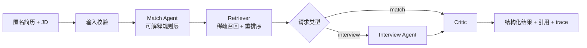

# CareerAgent：证据驱动型岗位匹配与面试准备 Copilot

CareerAgent 是一个面向校招场景的本地可运行 MVP。它不会预测 offer，也不会根据“简历中未出现某项技能”断言候选人不具备能力；它只输出带有简历、JD 或知识库片段的可追溯结论。

## 已实现能力

- **岗位匹配**：从简历/JD 中抽取有限且可审计的技能词表，按维度输出 `match`、`partial`、`missing_evidence`，而不是生成无依据的总评。
- **检索与引用**：本地稀疏检索基线 + 技能重排序，返回知识库片段与来源 ID。
- **面试准备**：根据岗位维度和缺少证据项生成可追问的问题、目的与准备建议。
- **Critic**：验证原始输入是否被引用、匹配维度是否有依据、问题是否有引用，并拦截“保证 offer”等过度承诺。
- **Trace 与评测**：记录每个工作流节点耗时；内置 12 条模拟资料检索评测样本。
- **浏览器演示**：使用标准库 HTTP 服务提供匿名简历/JD 输入与 JSON 结果展示，无 API key、无 Docker、无网络依赖。

## 工作流



## 快速开始

需要 Python 3.11+，不需要安装依赖：

```powershell
python -m unittest discover -s tests -v
python -m career_agent.cli evaluate --top-k 3
python -m career_agent.cli demo
python -m career_agent.cli serve --port 8000
```

打开 `http://127.0.0.1:8000` 即可试用。接口包括：

- `GET /health`
- `POST /api/match`
- `POST /api/interview`

请求体示例：

```json
{
  "resume_text": "匿名简历文本",
  "jd_text": "岗位 JD 文本"
}
```

## 当前评测基线

在仓库内 **12 条模拟资料检索样本** 上，运行 `python -m career_agent.cli evaluate --top-k 3` 的真实结果为：

| 指标 | 结果 |
| --- | --- |
| Recall@3 | 0.9167 |
| MRR@3 | 0.8750 |

这只是用于回归测试的本地基线，不能外推为真实校招语料效果。下一步应替换为经过来源记录和人工标注的公开 JD/公司资料，并扩展为至少 50 条评测样本。

## 数据边界

`career_agent/data/knowledge_base.json` 和 `evaluation.json` 是为可复现测试撰写的本地演示资料，不包含真实求职者数据，也不对应任何公司的真实招聘承诺。实际使用时请使用本人脱敏简历，并记录公开资料来源和保存日期。

## 项目结构

```text
career_agent/
├── api.py          # 浏览器演示与 JSON API
├── workflow.py     # 显式路由、trace 与节点编排
├── matching.py     # 证据优先的匹配规则
├── retrieval.py    # 稀疏召回与重排序基线
├── critic.py       # 引用与边界校验
├── evaluation.py   # 离线评测
└── data/           # 本地演示语料、样例和评测集
tests/
└── test_career_agent.py
```

## 后续演进

当可安装依赖后，保持当前接口不变，将 `workflow.py` 节点适配为 LangGraph，将 `LocalRetriever` 迁移为 embedding + Qdrant，并以 FastAPI 替换 `api.py`。这些属于下一阶段改造，当前版本不会假称已经完成。
