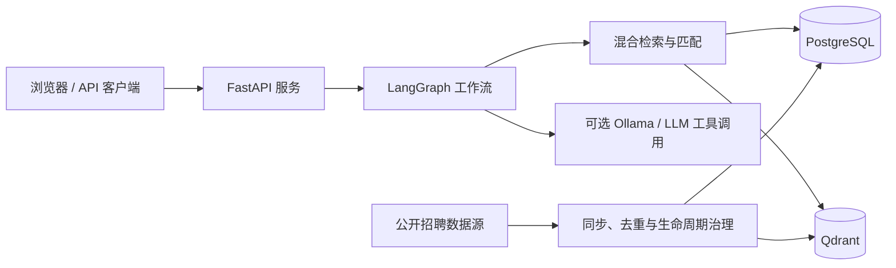

# CareerAgent｜多源招聘检索与职业规划 Agent 系统

CareerAgent 是一个面向校招、社招与实习场景的求职检索与职业规划应用。它将职位数据治理、混合检索、简历解析、岗位匹配与面试准备整合到本地可运行的服务中，并对职位时效与模型调用边界保持可追溯的表达。

> 当前定位：带职位生命周期治理的求职检索产品 MVP。项目既支持基于 LangGraph 的确定性匹配工作流，也提供可选的 LLM 工具调用能力；未配置模型时仍可完成可解释的检索和匹配。

## 功能概览

- **职位数据治理**：将不同公开来源的职位标准化为公司、职位、地点、届别、来源、外部 ID、版本、状态与首次/最后发现时间等字段；支持去重、增量同步、状态核验、历史归档和保留期清理。
- **混合职位检索**：结合结构化条件过滤、公司精确/别名匹配、关键词匹配和向量检索；实时职位与历史职位分开索引，避免历史职位干扰默认求职搜索。
- **简历与 JD 匹配**：解析 TXT/DOCX 简历，输出匹配依据、技能缺口与面试准备建议；不会把“简历未提及”直接解释为能力缺失。
- **受控 Agent 工作流**：使用 LangGraph 编排输入校验、岗位匹配、面试准备与质量审查节点；可选 LLM Agent 只能调用受限的只读工具，并保留工具轨迹与确定性降级路径。
- **求职工作台**：提供职位详情、收藏、投递阶段跟踪、订阅命中预览、来源健康和数据质量接口。

## 架构



## 快速开始

### 1. 安装依赖

建议使用 Python 3.11+：

```powershell
git clone https://github.com/salt-me/careerAgent.git
cd careerAgent

python -m venv .venv
.\.venv\Scripts\python.exe -m pip install --upgrade pip
.\.venv\Scripts\python.exe -m pip install -r requirements-career-platform.txt
```

### 2. 运行完整本地求职平台

此入口使用本地 SQLite/Qdrant 路径。首次本机运行应加载 `.env.career-platform.local`；Docker 版则使用 PostgreSQL 与 Qdrant 服务：

```powershell
.\.venv\Scripts\python.exe -m uvicorn career_agent.career_portal_complete_asgi:app --env-file .env.career-platform.local --host 127.0.0.1 --port 8000
```

打开 [http://127.0.0.1:8000](http://127.0.0.1:8000)，或在 [http://127.0.0.1:8000/docs](http://127.0.0.1:8000/docs) 查看 OpenAPI 文档。

### 3. 运行完整职位平台（Docker Compose）

```powershell
# 已提供可直接使用的本机配置；Docker 配置使用 host.docker.internal 访问 Ollama。
# 如需重置配置，可从 .env.career-platform.example 复制。
docker compose -f docker-compose.career-platform.yml up --build
```

该配置启动 FastAPI、PostgreSQL 与 Qdrant。请在 `.env.career-platform` 中替换默认管理令牌，且不要提交此文件。

## 可选：接入本地 Ollama

CareerAgent 的 LLM 功能默认关闭。启用后，页面仍要求用户对每次模型调用明确同意；模型只有受限的只读检索、职位详情、匹配分析和来源时效工具，无法投递职位、删除数据或写入数据库。

先安装 Ollama 并拉取本地模型：

```powershell
ollama list
```

然后在 `.env.career-platform` 中设置：

```dotenv
CAREER_AGENT_LLM_ENABLED=true
CAREER_AGENT_LLM_PROVIDER=ollama
CAREER_AGENT_LLM_MODEL=career-qwen3:4b
CAREER_AGENT_LLM_TIMEOUT_SECONDS=120
CAREER_AGENT_LLM_MAX_OUTPUT_TOKENS=128

# 通过 Docker 运行 CareerAgent 时使用：
CAREER_AGENT_LLM_BASE_URL=http://host.docker.internal:11434/v1

# 直接在宿主机运行服务时使用 .env.career-platform.local，其中已设置：
# CAREER_AGENT_LLM_BASE_URL=http://127.0.0.1:11434/v1
```

> Docker Compose 不会自动启动 Ollama；Ollama 作为本机模型服务单独运行。模型未配置、用户未同意调用或调用失败时，系统会回退到确定性匹配流程。

## 测试与评测

```powershell
.\.venv\Scripts\python.exe -m pytest -q
```

测试套件覆盖 Agent 工具边界、检索精度、职位生命周期、数据源连接器、简历解析、门户 API 与数据质量。

人工评测使用 JSONL 管理：

- [标注指南](evals/CAREER_AGENT_EVAL_GUIDE.md)
- [评测模板](evals/careeragent_eval_template.jsonl)
- [示例用例](evals/careeragent_eval_examples.jsonl)

人工评测用于衡量检索相关性、岗位意图识别、引用完整性和时效表述准确性；模板与示例不等同于已完成的大规模标注结果。

## 数据与时效边界

- 仓库包含公开、可审计的职位语料及其来源信息；其中包含万级 CC0 公开职位记录和官方 ATS 来源样本。
- `open`、`closed` 与 `pending_verification` 是不同状态。待核验不代表仍在招聘，已关闭职位则保留在历史索引中供趋势分析。
- 招聘页面和岗位状态随时可能改变；投递前请以职位官方链接与企业招聘页面为准。
- 仅应使用符合来源条款和许可范围的数据；发布或扩展数据集前，请保留来源、许可证和采集时间记录。

## 项目结构

```text
career_agent/                 # 核心业务代码、Agent、检索与数据生命周期模块
career_agent/data/            # 公开职位语料、样例与数据清单
tests/                        # pytest 自动化测试
evals/                        # 人工评测模板、示例与标注规范
docker-compose.career-platform.yml
Dockerfile.career-platform
requirements-career-platform.txt
```

## 已知限制与路线图

- 该项目目前是本地可运行的 MVP，尚未提供完整的多用户账户、权限、云端备份、告警和生产级运维能力。
- 并非所有来源都能实时、完整地枚举职位；未验证来源不会被错误标记为关闭。
- 默认环境文件启用百度 2027 届校招公开 SSR 首屏、拼多多校招公开分页接口、联想中国官网公开分页接口，以及 Shopee、JoinQuant、NVIDIA 官方 Moka 的完整公开岗位同步。联想、Shopee 三个板块、JoinQuant 校招板块和 NVIDIA 的 2027 校招与实习板块均已验证完整分页和稳定职位 ID，按权威源处理；百度和拼多多仍是非 authoritative 来源，不会因一次或多次列表变化自动关闭职位。华为、OPPO、Bambu Lab、DJI、智元机器人、普渡科技、科大讯飞、Ubiquant 和腾讯音乐仍是待验收的企业官方候选源；个人中心、投递记录和带令牌链接不会被采集。
- 后续重点包括：扩展可稳定核验的中文官方来源、完成更大规模人工标注评测、完善 Ollama 端到端验证、接入云端部署与运行监控。

详细说明请参阅：[项目成熟度路线图](CAREER_AGENT_MATURITY_ROADMAP.md)、[运行入口](START_HERE_CAREER_AGENT.md) 和 [数据来源契约](OFFICIAL_SOURCE_CONTRACTS.md)。
