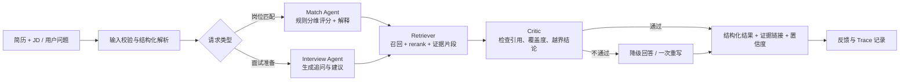

# CareerAgent 项目蓝图（可投递、可落地版）

> 项目定位：面向校招的“有证据链的岗位匹配与面试准备 Copilot”。
>
> 目标：用一个可运行、可评测、可复盘的小型 LLM 应用，证明 RAG、Agent 工作流、结构化输出、服务化和质量评测能力；不把它包装成自动投递或万能求职机器人。

## 1. 要解决的问题

普通求职类 LLM 应用常见问题是：匹配分数缺乏依据、面试建议来自模型编造、回答无法追溯来源。

系统以一份匿名简历和一条岗位 JD 为输入，输出：

1. 维度化匹配结果：必备技能、项目经历、教育/实习、加分项；
2. 每条结论对应的简历/JD/知识库证据；
3. 明确区分“缺少证据”和“能力不匹配”，避免错误否定；
4. 基于岗位要求和能力缺口的面试追问与短期补齐建议；
5. 低置信度、无检索依据或无引用的回答会被拦截并要求重写。

非目标：自动爬取招聘网站、替用户投递、生成虚构经历、声称预测 offer 概率。

## 2. MVP 边界

| 内容 | MVP 必做 | 后续可选 |
| --- | --- | --- |
| 数据 | 50–100 条人工筛选并标注来源的公开 JD；20–30 份公开公司/面经资料；3 份脱敏示例简历 | 增加学校、城市、行业维度 |
| 输入 | PDF/DOCX/TXT 简历、粘贴 JD | 批量 JD 导入 |
| 检索 | 文档清洗、切分、向量召回、rerank、来源引用 | 混合检索、query rewrite |
| 工作流 | 岗位匹配、面试准备两个明确流程；一次 Critic 校验 | 反馈驱动的策略选择 |
| 产品 | FastAPI 接口 + 简单 Web 页面 + 任务追踪页 | 登录、多用户、云部署 |
| 评测 | 50 条离线测试样本，Recall@k、引用正确率、回答有依据率 | LangSmith 在线观测、A/B 实验 |

## 3. 架构与工作流

这里的“Agent”不是把所有函数都贴标签：

- `Retriever` 是受控工具链，不自主决策；
- `Match Agent` 与 `Interview Agent` 是两个业务能力不同的 LangGraph 节点；
- `Critic` 是确定性的质量闸门：检查每项结论是否存在证据、引用是否属于当前资料、输出是否符合 Pydantic schema；
- 顶层使用条件路由而非复杂 Supervisor。这样更容易解释，也符合“先选简单 handoff/workflow，按需拆多 Agent”的工程原则。

## 4. 关键实现设计

### 4.1 数据与结构化 schema

- `ResumeProfile`：education、skills、projects、internships、evidence_spans。
- `JobProfile`：must_have、preferred、responsibilities、location、source_url、published_at。
- `MatchResult`：每个维度的结论（match/partial/missing_evidence/gap）、证据 ID、置信度、行动建议。
- `Citation`：document_id、chunk_id、原文片段、source_url；输出中仅展示可追溯信息。

简历一律用自己的脱敏版本或虚构示例；JD 和公司资料记录公开来源、抓取/保存日期和许可证说明。不要上传同学简历或含个人联系方式的面经。

### 4.2 匹配逻辑

1. 用 Pydantic 的结构化输出抽取简历和 JD，而不是直接让模型“打分”。
2. 对必备项/加分项使用可解释的规则层，得到维度级的 `match/partial/missing_evidence`。
3. 检索公司背景、岗位语境和面试资料，为解释和追问提供资料。
4. LLM 只负责把规则结果与检索证据组织成自然语言；不得把“简历未写”推断为“不会”。

### 4.3 检索链路

`PDF/DOCX/TXT -> 清洗去重 -> 按标题与段落切分 -> embedding -> Qdrant -> top-k 召回 -> reranker -> 引用组装`

起步可使用 API embedding/reranker，避免本地 GPU 成为阻塞；所有模型、chunk size、top-k、阈值写入版本化配置，以支持可重复评测。

### 4.4 技术栈

- Python 3.12、uv、pytest、ruff、Pydantic v2；
- LangGraph（当前稳定版）负责状态、路由、checkpoint 与 interrupt；
- FastAPI + SSE/streaming 提供 API；前端初期采用 Jinja/HTMX 或 Streamlit，避免 React 占用项目时间；
- Qdrant（Docker）保存向量，SQLite 保存用户任务、反馈、配置和评测结果；
- Docker Compose 一键启动，`.env.example` 不含真实密钥；
- 可选 LangSmith 或 OpenTelemetry 记录 trace、模型耗时和 token 成本。

## 5. 质量评测

人工构造并版本化 50 条样本：岗位匹配问题、公司资料问答、面试准备问题、无依据/越界问题各占一部分。每条记录期望的证据文档与可接受答案要点。

| 指标 | 计算方式 | 用途 |
| --- | --- | --- |
| Recall@k | 期望证据是否进入 top-k | 验证召回是否找对材料 |
| MRR / nDCG@k | 正确证据的排序位置 | 验证 rerank 是否有效 |
| 引用正确率 | 抽样人工判断引用是否支持结论 | 验证可追溯性 |
| 回答有依据率 | 最终结论中具有有效引用的比例 | 衡量 Critic 效果 |
| 延迟与 token 成本 | 每个节点 trace 的 p50/p95 与调用量 | 体现工程权衡 |

实验至少对比两组：`向量召回` 与 `向量召回 + rerank`；`无 Critic` 与 `有 Critic`。只有实际跑出的结果才进入简历。

## 6. 交付物与验收

1. `README`：问题边界、架构图、安装方式、数据来源、演示 GIF、指标结果；
2. API：`POST /documents`、`POST /match`、`POST /interview-prep`、`POST /feedback`、`GET /traces/{id}`；
3. Web：上传/粘贴、结果页、证据展开、反馈按钮；
4. 测试：parser、citation validator、route、retriever 的单元测试与 50 条离线评测脚本；
5. 一份技术复盘：失败案例、指标、迭代决策与已知限制。

验收标准：陌生电脑按 README 可启动；演示的每条关键结论能定位来源；无依据问题不会伪造答案；评测可一键复现。

## 7. 12 天可落地排期

| 天数 | 可验证产出 |
| --- | --- |
| 1 | 项目初始化、schema、样例数据和 `README` 问题定义 |
| 2–3 | 文档解析、清洗、Qdrant 入库、基础检索 CLI |
| 4–5 | 简历/JD 结构化解析与可解释匹配 API |
| 6 | 引用返回与前端结果页 |
| 7–8 | Interview Agent、Critic 与失败降级 |
| 9 | LangGraph trace、反馈记录、异常处理 |
| 10 | 离线评测集和 rerank 实验 |
| 11 | Docker、pytest、ruff、README 演示 |
| 12 | 录制 demo、整理指标、模拟面试问答 |

若时间不足，保留“匹配 + 引用 + 评测”三个核心，先砍掉多用户、复杂前端、长期记忆和反馈训练。

## 8. 简历表述规则

项目未做完时，必须标注“开发中”，只写已经完成的设计或代码；不写效果数字，不使用“实现/优化/提升”等完成态动词描述未来功能。

项目完成后可写的版本：

**证据驱动型校招岗位匹配与面试准备 Copilot｜个人项目**  `2026.08–2026.09`

技术栈：`Python · LangGraph · FastAPI · Qdrant · Pydantic · RAG · Rerank · Docker · pytest`

- 独立构建面向校招的岗位匹配与面试准备工作流，基于 LangGraph 路由 Match、Interview 与 Critic 节点；将简历与 JD 解析为结构化 schema，并以规则层输出可解释的技能/经历匹配结论。
- 实现从文档清洗、切分、向量召回到 rerank 的 RAG 链路；在回答中绑定原文片段和来源 URL，并通过 Citation Validator 拦截无检索依据或引用不匹配的结论。
- 构建 **[实际数量]** 条离线评测集，对比向量召回与 rerank、引入 Critic 前后的 Recall@k / 引用正确率 / 有依据率；根据评测结果迭代 top-k、阈值和提示词配置。
- 使用 FastAPI 与 Docker Compose 完成服务化交付，结合 trace、pytest 和失败案例复盘，记录模型调用延迟、token 成本及可复现配置。

投递前可使用的诚实版本：

**证据驱动型校招岗位匹配与面试准备 Copilot｜个人项目（开发中）**  `2026.08–至今`

- 已完成项目问题定义、数据 schema、RAG/引用校验工作流和离线评测方案设计；当前正实现基于 LangGraph 的岗位匹配最小闭环。
- 计划使用公开来源 JD 与脱敏样例简历，验证“检索 + rerank + Critic”对引用正确率和回答有依据率的影响；完成后补充真实评测结果与开源地址。
